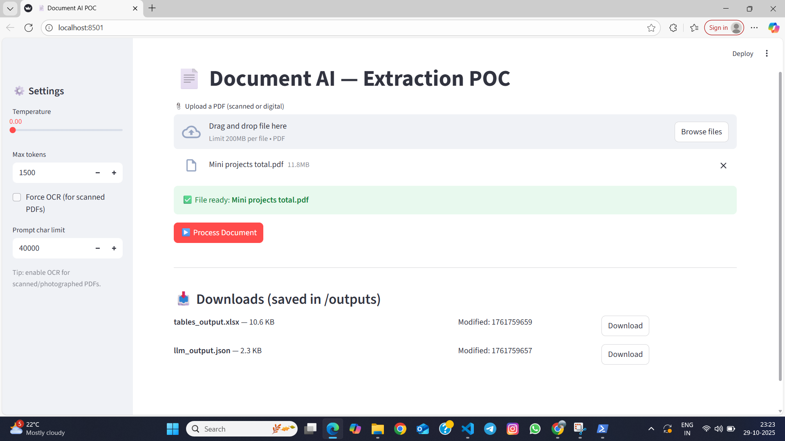

# 📄 Document AI — Extraction

A local Document AI pipeline built with Streamlit that extracts text, tables, and key-values from PDFs (scanned or digital), converts them into structured JSON, and generates insights using a Groq LLM via LangChain.

## 📸 Demo

## ✨ Features
* **PDF Processing:** Extracts text from both native and scanned PDFs (using Tesseract + Poppler for OCR).
* **Table Extraction:** Automatically finds and extracts tables (using `tabula-py` or `camelot`).
* **Key-Value Extraction:** Uses heuristic regex and line-based rules to find key-value pairs.
* **LLM Insights:** Generates structured JSON and human-readable insights using Groq via LangChain.
* **Export Options:** Save extracted tables to Excel and all data to a structured JSON file.
* **Simple UI:** Easy-to-use Streamlit interface for uploading files and viewing results.

## 📁 Project Structure
* `app.py`: Main Streamlit UI and pipeline orchestration.
* `ocr.py`: Text extraction and OCR logic.
* `table_extractor.py`: Table extraction utilities.
* `extractor.py`: Key-value heuristic logic.
* `llm_client.py`: Groq and LangChain wrapper.
* `utils.py`: Helper functions (e.g., saving JSON/Excel).
* `requirements.txt`: Python dependencies.
